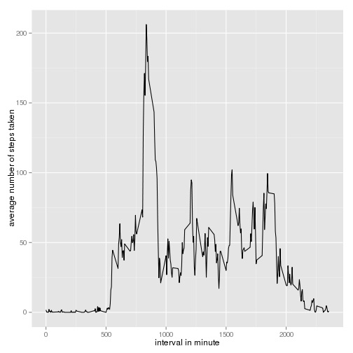

# Reproducible Research: Peer Assessment 1

## Overview 
This assignment is to analysis of personal movement activity data. The dataset is given in the file "repdata_data_activity.zip" which can be downloaded from the link "https://d396qusza40orc.cloudfront.net/repdata%2Fdata%2Factivity.zip". The activity monitoring device collects data at 5 minute intervals through out the day. The data consists of two months of data from an anonymous individual collected during the months of October and November, 2012 and include the number of steps taken in 5 minute intervals each day. 

## Loading and preprocessing the data
Assuming that "activity.zip" file is in the current directory

```r
unzip("activity.zip")
data<- read.csv("activity.csv", header=TRUE)
str(data)  # check the default data field type
data$date <- as.Date(data$date, format= "%Y-%m-%d") #Convert date field to Date class
```

```
## 'data.frame':	17568 obs. of  3 variables:
##  $ steps   : int  NA NA NA NA NA NA NA NA NA NA ...
##  $ date    : Factor w/ 61 levels "2012-10-01","2012-10-02",..: 1 1 1 1 1 1 1 1 1 1 ...
##  $ interval: int  0 5 10 15 20 25 30 35 40 45 ...
```

## What is mean total number of steps taken per day?
Ignoring missing values in data.

```r
# 1. Calculate the total number of steps taken per day
steps_per_day <- tapply(data$steps, data$date,sum) 
# 2. Draw a histogram of the total number of steps taken each day
hist(steps_per_day, xlab = "Total steps per day", breaks = 20,  main = "Total daily steps") 
```

 

```r
# 3. calculate the mean and median of the number of steps taken per day
steps_mean   <- mean(steps_per_day, na.rm=TRUE)
steps_median <- median(steps_per_day, na.rm=TRUE)
steps_mean; steps_median  # print mean and median
```

```
## [1] 10766.19
## [1] 10765
```

The mean is 10766.19 and median is 10765.
## What is the average daily activity pattern?

```r
# 1. Genarate avarage steps in each 5-minute interval across all days
# make interval field as factor of 5-minute interval
data$interval <- factor(as.character(data$interval), levels=unique(data$interval)) 
avarage_steps_in_interval <- tapply(data$steps, data$interval, mean, na.rm = TRUE)
plot(avarage_steps_in_interval, type = "l",
   main = "Average steps 5-minute interval across all days",
     ylab = "Average steps", xlab = "5-minute interval")
```

 

```r
# 2. Which 5-minute interval, on average across all the days in the dataset, 
# contains the maximum number of steps?
intervals <- data.frame(interval=names(avarage_steps_in_interval),mean=avarage_steps_in_interval)
max_interval <- intervals[which.max(df$mean),]
max_interval
```

```
##     interval     mean
## 835      835 206.1698
```
The 5-minute interval with the highest average number of steps corresponds to the interval between 835 and 840 (ie, 8:35 AM and 8:40 AM).
The 835th interval has maximum 206.17 steps.

## Imputing missing values
###1.Calculate and report the total number of missing values in the dataset 

```r
# is.na() check whether the value is NA or not
total_missing_value <- sum(is.na(data$steps)) 
total_missing_value 
```

```
## [1] 2304
```

The total number of missing value in this dataset is 2304.
### 2. Filling in all of the missing values in the dataset
The strategy for filling in all of the missing values in the dataset, we use the mean for that 5-minute interval

```r
impute_missing <- function(dat, intervals){
  na_idx <- which(is.na(dat$steps))
  for(i in c(na_idx)) {
    inter <- dat[i,]$interval
    dat[i,]$steps <- intervals[inter,]$mean
   }
  dat
}
```

### 3. Create a new dataset that is equal to the original dataset but with the missing data filled in.

```r
intervals$interval <- as.numeric(intervals$interval)
new_data <- impute_missing(data, intervals)
steps_per_day <- tapply(new_data$steps, new_data$date,sum)
```

### 4.Make a histogram of the total number of steps taken each day and Calculate and 
### report the mean and median total number of steps taken per day.

```r
hist(steps_per_day, xlab = "Total steps per day", breaks = 20, main = "Total daily steps") 
```

 

```r
new_steps_mean   <- mean(steps_per_day, na.rm=TRUE)
new_steps_median <- median(steps_per_day, na.rm=TRUE)
new_steps_mean; new_steps_median  # print mean and median of new dataset
```

```
## [1] 10766.19
## [1] 10766.19
```

The mean is 10766.19 and median is 10766.19. Because we  have chosen mean value to impute the missing values, the mean of the original data set and new dataset remain same. The value of median getting closer to mean, because all the imputing values are mean value so median is shifted towrds mean.

## Are there differences in activity patterns between weekdays and weekends?   

```r
# Create a new dataset with adding a new field daytype (whether a day is weekday or weekend).
activity_data <- cbind(new_data, daytype=ifelse(weekdays(new_data$date) == "Saturday" |       
                                      weekdays(new_data$date) == "Sunday", "weekend", "weekday"))

activity_data$interval <- as.numeric(activity_data$interval)
averages <- aggregate(steps ~ interval + daytype, data=activity_data, mean)
library(ggplot2)
ggplot(averages, aes(interval, steps)) + geom_line() + facet_wrap(~daytype,nrow=2, ncol=1 ) +xlab("5-minute interval") + ylab("Number of steps")
```

 

From the above graph we can see that in weekdays, there is high peek in 8:00 AM (=96*5/60) - 10:00 AM (=120*5/60) time intervals and very low in rest of the intervals. The reason of this pattern could be due to routine office work,  and that high peek time interval is used to do more intensity activity. In other hand, at weekend the activity pattern spread across through over the day.

